# Group 7 - project group assignment

## Part 1
We have decided to create habit/productivity tracker app.
Our target audience is anyone who needs support in sticking to tasks/self-care. We want to cater to neurodivergent users in particular.

The concept is a habit tracker app that can be used to track a range of habits. The habits that we have chosen to develop as main components are:

1. Hydration
2. Nutrition: can integrate the following APIs: FoodData Central, Nutritionix, Chomp, Edamam nutrition and Edamam recipes
3. Sleep
4. Social
5. Hobbies
6. Movement: can integrate the following APIs - Strava, Fitbit, Tredict, Wger
The app will also include functionality for the user to enter any individual/unique habits that they want to track.

Within each of the components above, we will include:
- Options for long-term and/or short-term tracking
- Daily overview
- Weekly overview
- Monthly overview
- Yearly overview
- Setting up reminders to encourage habit completion
Can integrate the following APIs to facilitate the above: Google Calendar, UK Holidays, Pusher Beams

We would also like to include the following functionalities within the app:
- Short form journal entry 
- Productivity timer features (e.g. Pomodoro): can integrate the CountAPI for this function
- Options for social sharing and following friends on the app: can integrate Facebook, Instagram, LinkedIn, MeetUp, TikTok and X (Twitter) APIs for this function
- Accessibility options e.g. large font, contrast colours, light/dark mode, etc.

We will be using the following tools to build the app:
1. Frontend: React.js, Bootstrap - for building the user interface.
2. Backend: Node.js with Express - for server-side logic and API endpoints.
3. MySQL: for database management.
4. APIs: for user authentication, sending SMS reminders
5. Git with Github for version control and collaboration.
6. Deployment: TBC

**How we will be organising our workload**
As per our SWOT analysis, we have identified that some of our team members have availability during the week, whereas others do not (due to working hours, family commitments, etc.). One of our team members will also be travelling abroad soon. During our second group meeting, we allocated tasks in accordance with availability. So far, we have prioritised the tasks that need to be completed as part of the project assignment due for submission on 02/08/24. We are also using our SWOT analysis to identify which team members would be best placed to complete particular tasks. For example, those who have identified front-end/creativity as strengths are working on the app’s design.

We are using our Slack channel to communicate with each other regularly. We will be meeting every Thursday at 6pm to discuss progress, follow up outstanding tasks and allocate new tasks for completion. Smaller meetings are being facilitated between the relevant team members who are working together on specific tasks. All meetings are being documented on a project calendar on the Notion page.

We have set up a Notion board, which we are using to collaborate and facilitate team working regardless of timing/availability. There are ways to track edits/changes on the Notion board, which can allow us to see each team member’s contributions. 

We are using ‘Sprint’ methodology to ensure that project tasks are being completed in a timely manner. We are using a task allocation board on the Notion page to create/edit tasks, allocate these to individual team members, highlight priority and completion status. All outstanding tasks are being filed under the Sprint dates within which they need to be completed. There is also a project backlog section where non-urgent tasks can be added.

We are using MIRO to create our wireframes, and Canva to create a mock-up of the front-end design of the app. All team members have access to these tools; each individual can add comments and make changes as needed.

**Main features of the project:**
- Must be neurodivergent friendly
- Must have a create account/login page
- Must have the following core habits integrated into the app as components: sleep, food, water intake, movement, hobbies, reading
- Must include a journal entry feature
- Must include a timer (e.g. Pomodoro)
- Must allow summary to be viewed on a daily, weekly, monthly and yearly level

## Part 2
**Wireframes**
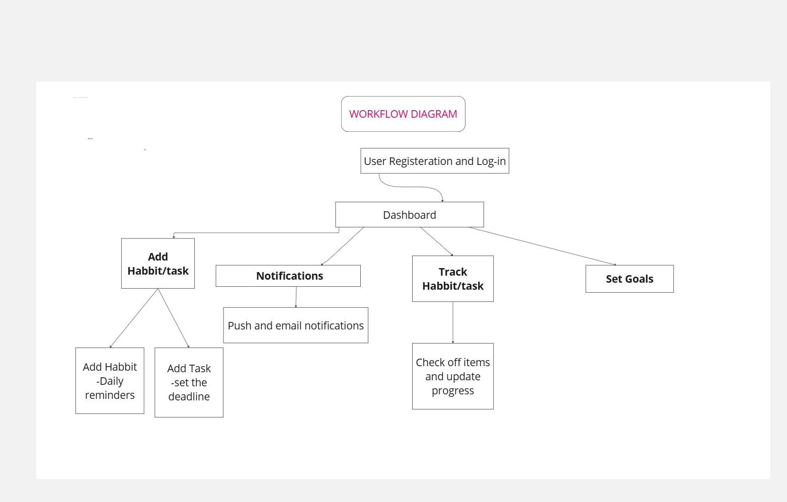
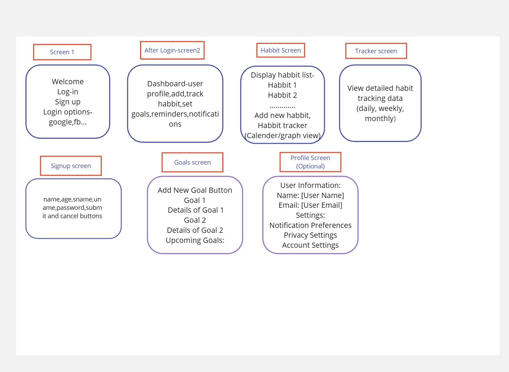

**Front-end design mockups**
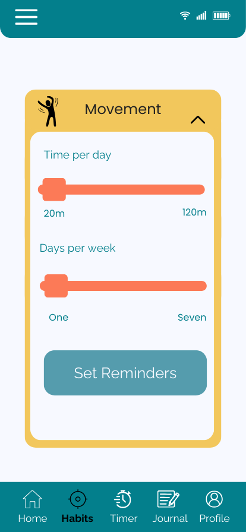
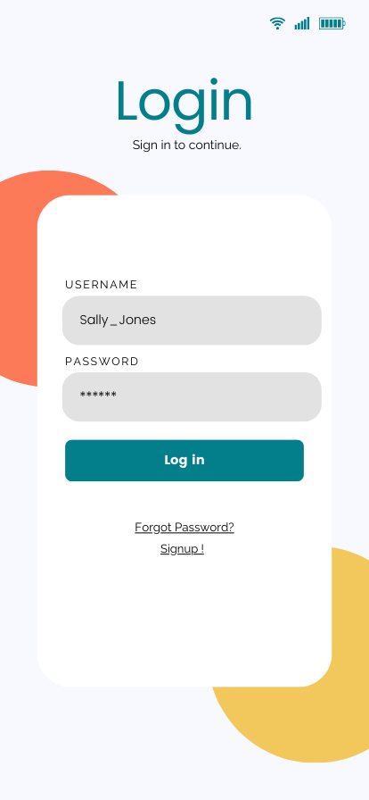
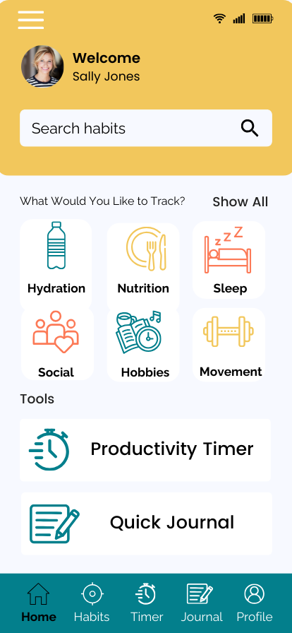
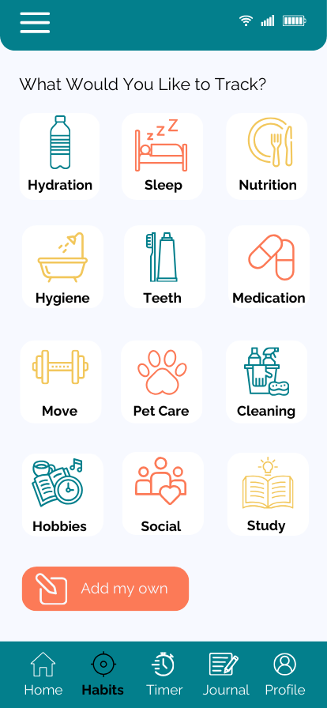

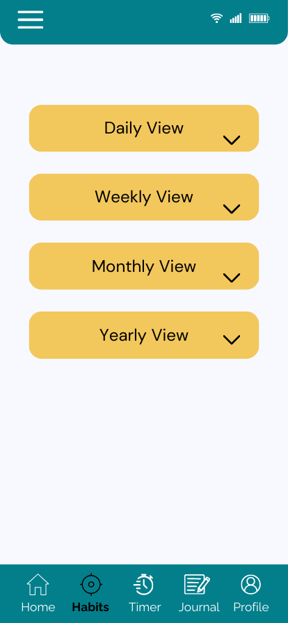
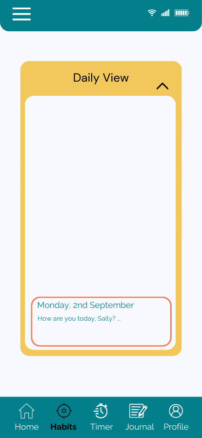
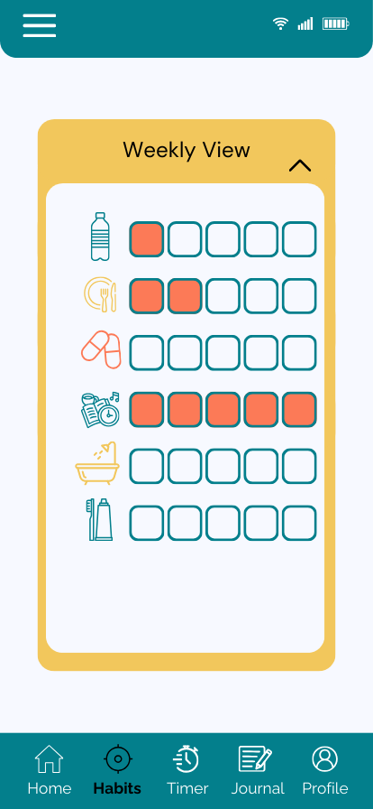
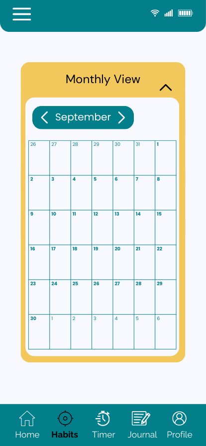
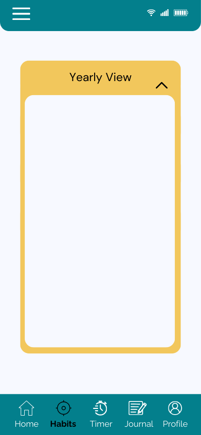
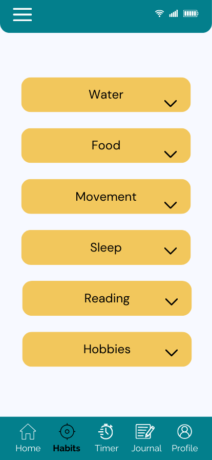
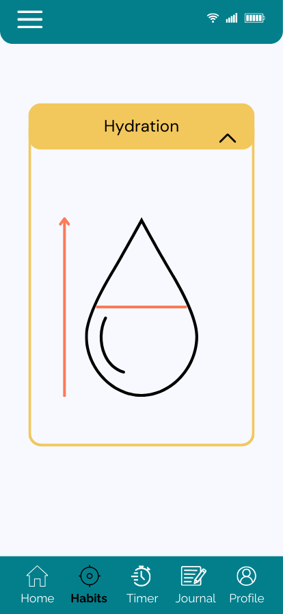
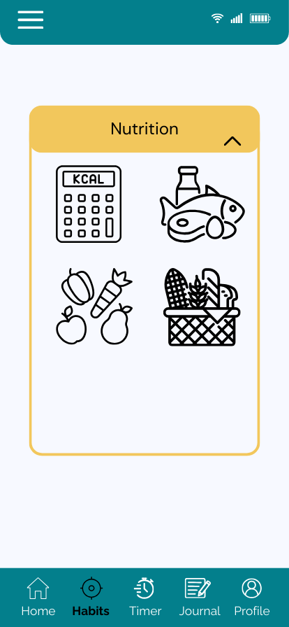
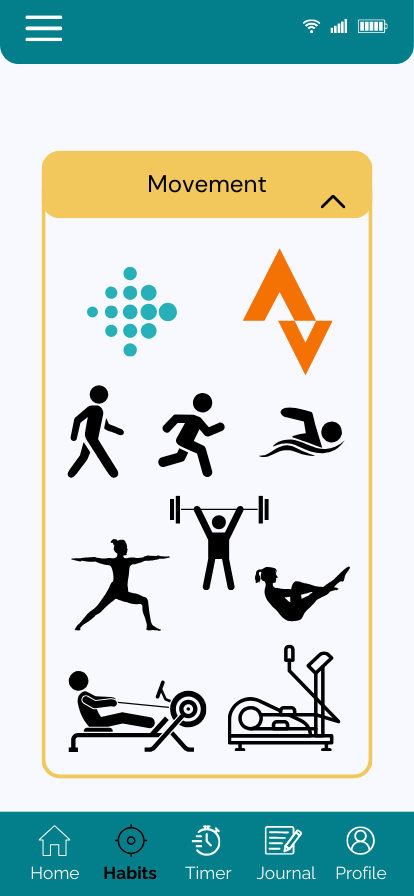

The following screens have been designed using Canva:
1. Create account/login page
2. Home page
3. Habit selector
4. Goal setting
5. Daily view
6. Weekly view
7. Monthly view
8. Overview with awards/completed goals etc.
9. Productivity Timer
10. Quick journal entry/view

Each screen needs to be clear and easy to use on a small screen as users are more likely to use this sort of app on a mobile device. Icons can be used to supplement text to increase accessibility and to aid speed/ease of use. Large clickable areas make use on a mobile device easier even for those with mobility issues. Components should not be too close together and the design must be responsive for use with different screen sizes and accessibility features like screen zoom.

Colours have been selected using Adobe colour trends and accessibility tools. We are aiming for a strong recognisable brand palette which is gender neutral and visually clean and crisp.

README file updated by SPatel on 30/07/24